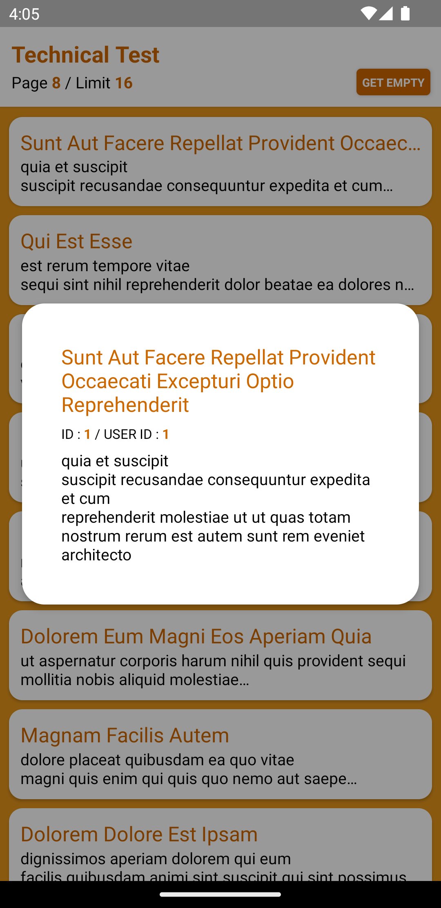

# Technical Test Umrona Official

## Requirements
* Fetch data from public API
* Create UI and show the data
* Show data details based on data ID
* Implement animation on the UI components with React Native Animated Library (Header and Skeleton Components)

## Showcase
     